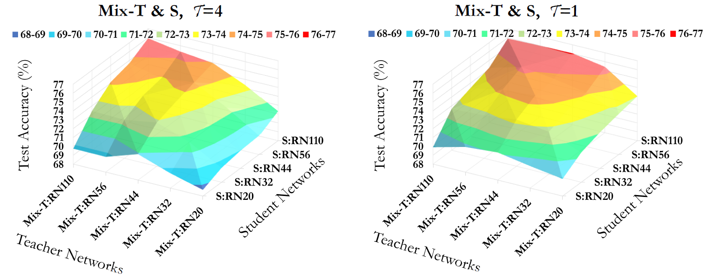

# MIX-KD
This repo is the official Pytorch code for our WACV 2023, "Understanding the Role of Mixup in Knowledge Distillation: An Empirical Study" [paper](https://arxiv.org/pdf/2211.03946.pdf)


# Requirement
This code was tested with Python 3.8.12, Torch 1.7.1, and CUDA 11.0. But it should work with a recent version of the torch.  

# Running
Please run the train_student_MIXSTD.py code to reproduce the results in the main paper. Also, note that you might want to adjust some hyper-parameters as follows:  

1. Download pretrained teacher model via [RepDistiller](https://github.com/HobbitLong/RepDistiller).

2. Hyper-parameters
   - ```pmixup```     : If ```True```, use the PMU (partial mixup). Otherwise, the FMU (full mixup) will be applied.
   - ```partmixup```  : the amount of mixup pairs as described in the paper.
   - ```gamma```      : weighting on the cross-entropy loss.
   - ```alpha```      : weighting on the KD loss.
   - ```beta_a```     : parameter in the beta distribution for the mixup.

# ToDo
* Adversarial attack on the CIFAR100
* Visualization code using tSNE
* ~~Training code on the CIFAR100~~


# Acknowledgement
I thank Yonglong for providing a very well-organized code. We tested our model based on [their code](https://github.com/HobbitLong/RepDistiller).
